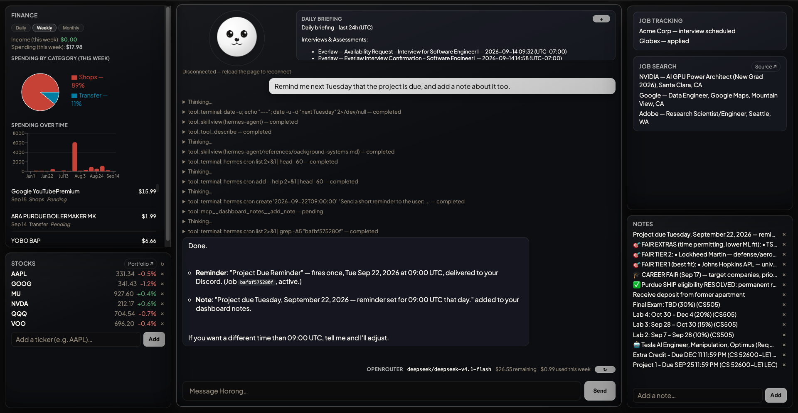
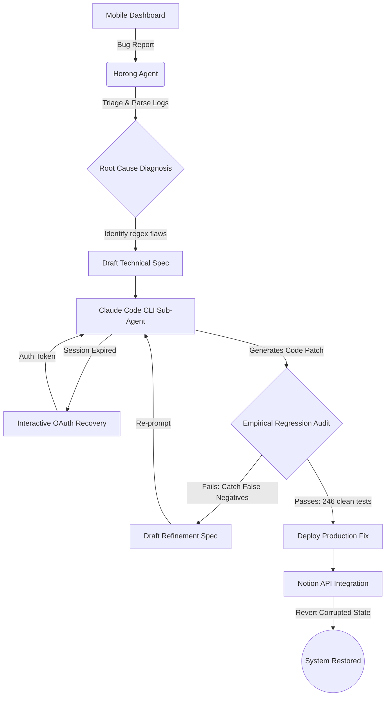
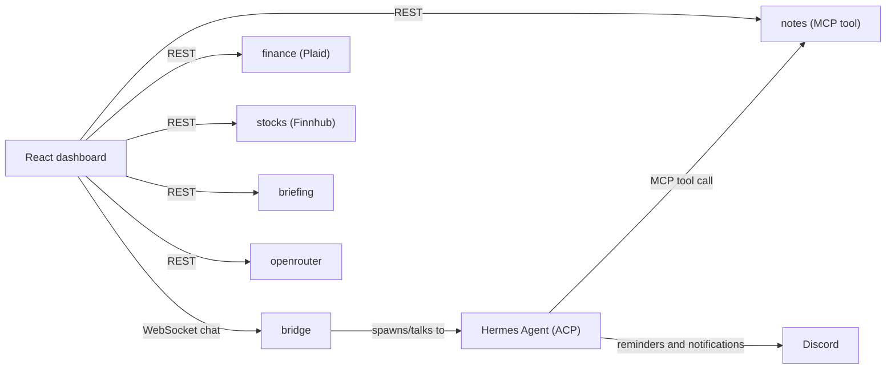

# Horong

A self-hosted personal dashboard and AI agent, built around [Hermes Agent](https://github.com/NousResearch/hermes-agent)
(NousResearch) as its conversational core. React frontend, six independent
Python microservices, one shared WebSocket bridge into the agent process,
running natively on a VPS under `systemd --user`.

## Screenshot

The chat panel here shows the agent handling a real multi-tool request end to
end: "remind me next Tuesday the project is due, and add a note about it." It
visibly calls a `cron` tool for the reminder and the custom notes MCP tool in
the same turn, with the new note landing in the Notes widget on the right.

## Demo: autonomous bug fix, reported from my phone

This walks through a real exchange with Horong, entirely from the
phone-installed dashboard app. It shows the agent behind Horong's chat
diagnosing a bug in one of my other personal automations (an email to Notion
job-application tracker, not part of this repo), delegating the code fix to
Claude Code, recovering from an expired auth session on its own, and
verifying the fix against real historical data before touching production.
It's a demo of what the agent reachable through Horong's chat can do, not a
claim that this specific bug's code lives in this repository.

### 1. Report the bug from the phone

One line, typed into Horong's chat on my phone: *"Hey something is wrong with
interview checking with email. I got false notification and updates on notion
on interview... for job application confirm."* The agent immediately starts
investigating on its own, reading the classifier source and the cron log.

### 2. Autonomous root-cause diagnosis

Without any further input, the agent finds three real false positives: plain
application-confirmation emails from Reducto, Atlassian, and SentiLink that
got misclassified as interview invites.

### 3. Pinpointing the exact cause and deciding to delegate

The agent digs one level deeper, showing the exact phrase each email matched
on (an overly generic `invite you to` pattern, and a conditional/hypothetical
phrase with no guard against it) before deciding this needs a real code fix
delegated to Claude Code.

### 4. Recovering from an expired session and handing off the fix

Claude Code's login had expired. The agent walked through re-authenticating
it (an interactive OAuth flow, not shown here) and, once logged in, handed
the fix spec off to Claude Code as a sub-agent.

### 5. Auditing the patch instead of trusting it

Rather than trusting Claude Code's first patch, the agent replayed the new
classifier against real inbox mail, and caught real problems: the patch had
introduced new false negatives (legitimate interview emails now getting
missed) alongside fixing the original bug.

### 6. Clean sweep across the full inbox history, then the agent improves itself

After a second round with Claude Code, a full replay across **246 emails
spanning the inbox's history plans zero updates**, no remaining false
positives. The agent then does more than tidy up: the tool calls visible here
show it patching its own `job-application-tracker` skill with the corrected
classifier design and the audit methodology it just proved out, and adding a
durable memory entry recording the Claude Code OAuth re-authentication
procedure for next time. It isn't just fixing the bug: it's updating its own
knowledge so this class of problem is handled better in future sessions.

### 7. What was actually wrong, and how it was fixed

The agent's own summary of the fix: the original classifier matched
interview signals on loose phrases with no guard for conditional wording, and
missed a real rejection outright. The rewrite is a tiered, testable
`classify_email()` function.

### 8. Repairing the damage already done

With the classifier fixed, the agent goes back and repairs the Notion records
the original bug had already corrupted (SentiLink reverted to Rejected,
Atlassian's note corrected), while leaving every genuine assessment/interview
entry untouched. All from one message sent while away from my laptop.

### Autonomous self-healing flow

## What it does

- **Chat with the agent** over a persistent WebSocket connection into a
  Hermes Agent process (also reachable on Discord), with live streaming
  responses.
- **Finance**: linked bank accounts via [Plaid](https://plaid.com/), spend
  charted by category (bar + pie) with a synced backend cache.
- **Stocks**: live quotes via [Finnhub](https://finnhub.io/), persisted to
  a local store.
- **Notes**: a lightweight note-taking widget backed by an MCP tool the
  agent itself can call (`add_note`), so notes taken by the agent during a
  conversation show up in the UI immediately.
- **Daily briefing**: a scheduled summary widget.
- **OpenRouter usage**: a live spend/credit bar for the model provider
  powering the agent.
- **Discord notifications**: reminders and other proactive agent output
  (e.g. the cron reminder in the screenshot above) are delivered to Discord,
  so they reach you even when the dashboard tab isn't open.

## Architecture

The frontend talks to each widget's backend directly over REST for its own
data; the bridge is only for the chat WebSocket into the agent process. The
agent, in turn, can call back into the Notes service itself via MCP: the one
path where the agent writes to the dashboard rather than the other way
around (see the screenshot above).

Each backend service is an independently deployable process (own
`requirements.txt`, own `systemd` unit, own tests) rather than a shared
monolith, so a bug or redeploy in one widget's service can't take down the
others or the chat bridge.

## Stack

- **Frontend:** React 19, TypeScript, Vite, Recharts, `react-plaid-link`,
  Vitest + Testing Library
- **Backend:** Python (aiohttp / FastAPI+uvicorn), SQLite, `pytest`
- **Agent runtime:** [Hermes Agent](https://github.com/NousResearch/hermes-agent),
  driven over the [Agent Client Protocol](https://agentclientprotocol.com/) (ACP)
- **Infra:** VPS, `systemd --user` services, Tailscale for private networking,
  Discord as an additional chat surface

## Repo layout

| Path | What |
|---|---|
| `frontend/` | React dashboard (chat panel, widgets) |
| `bridge/` | WebSocket ⇄ ACP bridge into the Hermes agent process |
| `finance/`, `stocks/`, `notes/`, `briefing/`, `openrouter/` | Independent backend services, one per widget |

## Status

Live and running; Discord chat and every dashboard widget (Finance, Stocks,
Notes, Briefing, OpenRouter) are working end to end. Email as a second chat
surface is implemented but disabled pending a fix for an upstream
seen-tracking bug in the underlying agent framework.
