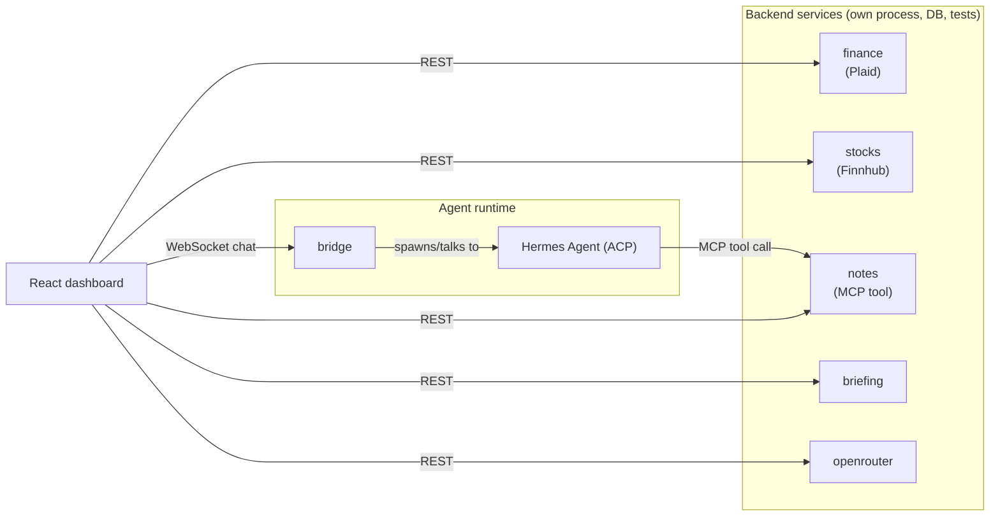

# Horong

A self-hosted personal dashboard and AI agent, built around [Hermes Agent](https://github.com/NousResearch/hermes-agent)
(NousResearch) as its conversational core. React frontend, six independent
Python microservices, one shared WebSocket bridge into the agent process,
running natively on a VPS under `systemd --user`.

## Screenshot

The chat panel here shows the agent handling a real multi-tool request end to
end — "remind me next Tuesday the project is due, and add a note about it" —
visibly calling a `cron` tool for the reminder *and* the custom notes MCP tool
in the same turn, with the new note landing in the Notes widget on the right.

## What it does

- **Chat with the agent** over a persistent WebSocket connection into a
  Hermes Agent process (also reachable on Discord), with live streaming
  responses.
- **Finance** — linked bank accounts via [Plaid](https://plaid.com/), spend
  charted by category (bar + pie) with a synced backend cache.
- **Stocks** — live quotes via [Finnhub](https://finnhub.io/), persisted to
  a local store.
- **Notes** — a lightweight note-taking widget backed by an MCP tool the
  agent itself can call (`add_note`), so notes taken by the agent during a
  conversation show up in the UI immediately.
- **Daily briefing** — a scheduled summary widget.
- **OpenRouter usage** — a live spend/credit bar for the model provider
  powering the agent.

## Architecture

The frontend talks to each widget's backend directly over REST for its own
data; the bridge is only for the chat WebSocket into the agent process. The
agent, in turn, can call back into the Notes service itself via MCP — the
one path where the agent writes to the dashboard rather than the other way
around (see the screenshot above).

Each backend service is an independently deployable process (own
`requirements.txt`, own `systemd` unit, own tests) rather than a shared
monolith — a bug or redeploy in one widget's service can't take down the
others or the chat bridge.

## Stack

- **Frontend:** React 19, TypeScript, Vite, Recharts, `react-plaid-link`,
  Vitest + Testing Library
- **Backend:** Python (aiohttp / FastAPI+uvicorn), SQLite, `pytest`
- **Agent runtime:** [Hermes Agent](https://github.com/NousResearch/hermes-agent),
  driven over the [Agent Client Protocol](https://agentclientprotocol.com/) (ACP)
- **Infra:** VPS, `systemd --user` services, Tailscale for private networking,
  Discord as an additional chat surface

## Repo layout

| Path | What |
|---|---|
| `frontend/` | React dashboard (chat panel, widgets) |
| `bridge/` | WebSocket ⇄ ACP bridge into the Hermes agent process |
| `finance/`, `stocks/`, `notes/`, `briefing/`, `openrouter/` | Independent backend services, one per widget |

## Status

Live and running; Discord chat and every dashboard widget (Finance, Stocks,
Notes, Briefing, OpenRouter) are working end to end. Email as a second chat
surface is implemented but disabled pending a fix for an upstream
seen-tracking bug in the underlying agent framework.
