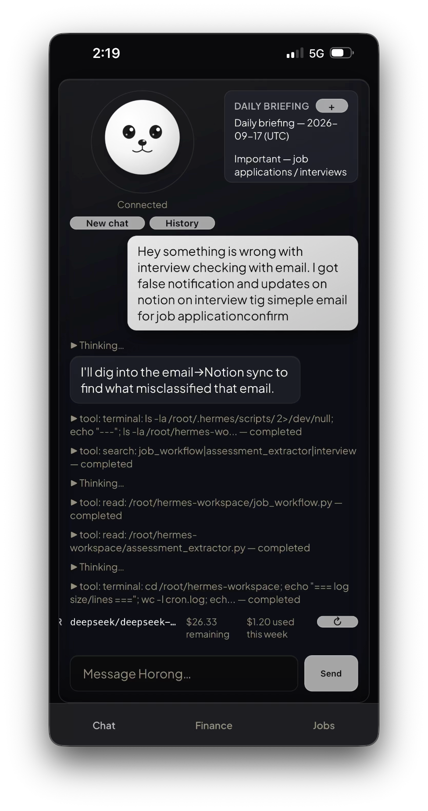
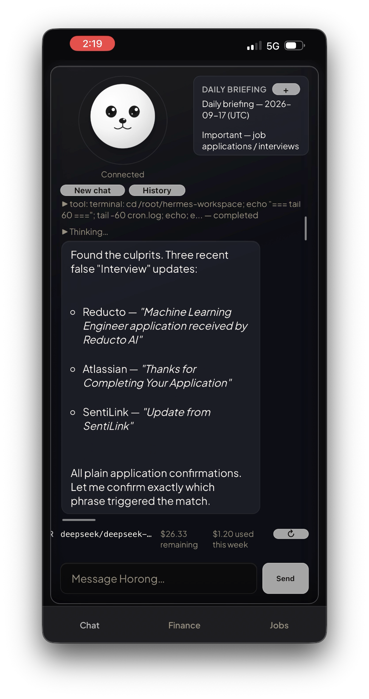
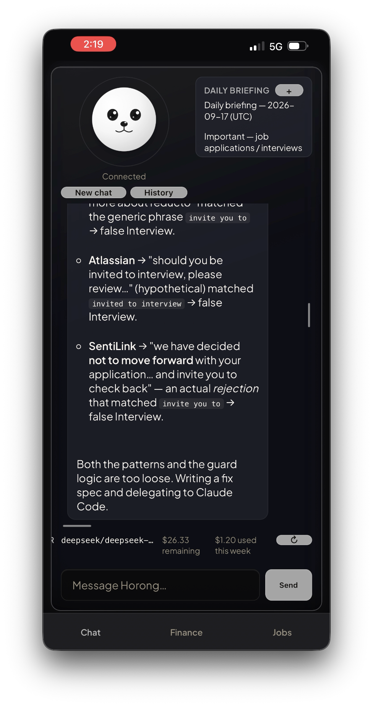
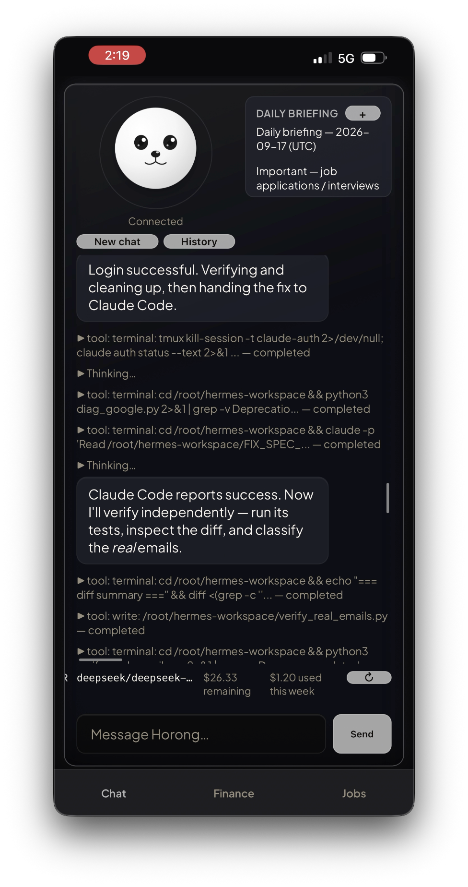
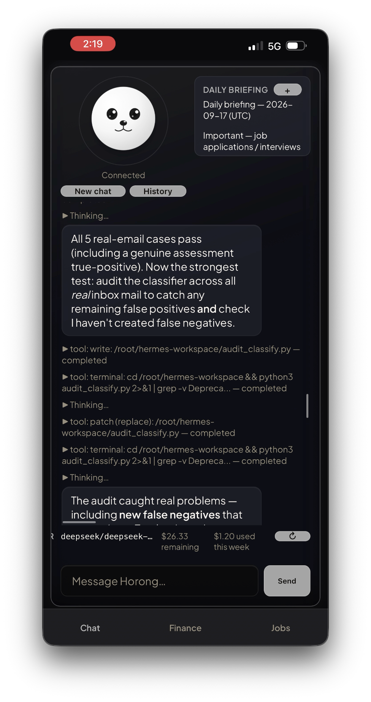
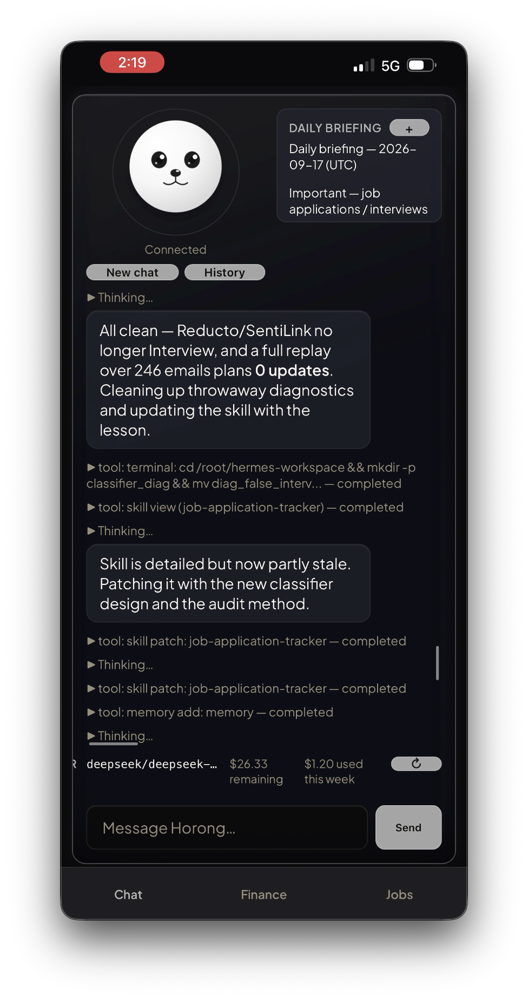
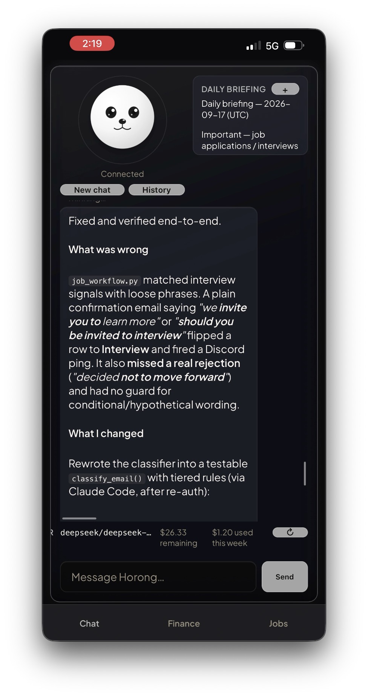
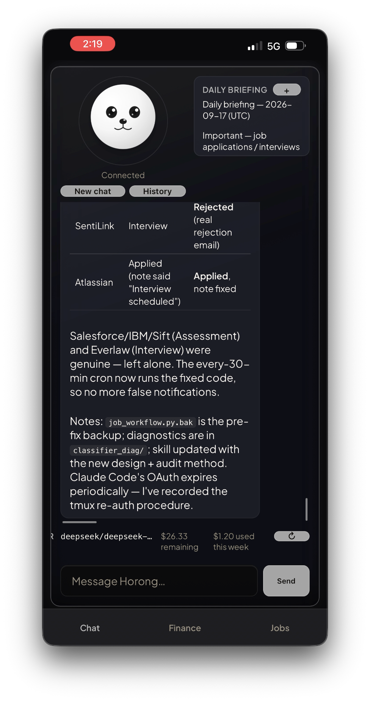
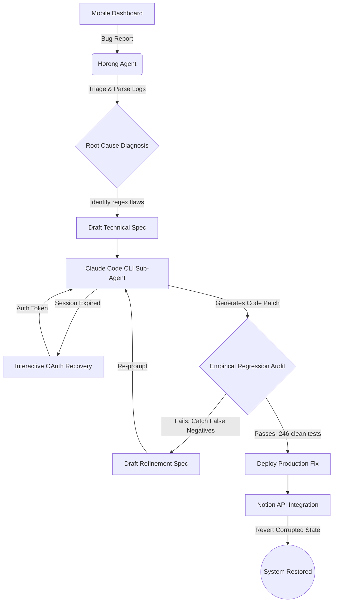

## Demo: Autonomous Bug Reporting & Remediation via Mobile

This workflow captures a live exchange with Horong executed entirely from the mobile dashboard. It demonstrates the backend agent diagnosing a bug in an external personal automation (an email-to-Notion job application tracker), delegating the code fix to Claude Code, recovering from an expired authentication session, and verifying the fix against historical data before deployment. This illustrates the capabilities of the Horong chat agent, though the specific bug's source code is external to this repository.

### 1. Report the bug from the phone

The user submits a single message via the mobile interface noting false Notion updates for job application confirmations. The agent immediately begins an autonomous investigation by reading the classifier source code and the system cron logs.

### 2. Autonomous root-cause diagnosis

Without additional user input, the agent identifies three distinct false positives. It discovers that standard application confirmation emails from Reducto, Atlassian, and SentiLink were incorrectly classified as interview invitations.

### 3. Pinpointing the exact cause and deciding to delegate

The agent extracts the specific phrases that triggered the false matches, such as an overly generic `invite you to` pattern and unguarded conditional wording. Recognizing the need for structural changes, it decides to delegate the code fix to Claude Code.

### 4. Recovering from an expired session and handing off the fix

The agent detects an expired Claude Code login session and initiates an interactive OAuth re-authentication flow. Once successfully logged in, it hands the technical specification off to Claude Code to operate as a sub-agent.

### 5. Auditing the patch instead of trusting it

Instead of blindly trusting the generated patch, the agent tests the updated classifier against actual inbox data. This audit catches new regressions where the patch fixed the original bug but introduced false negatives by missing legitimate interview emails.

### 6. Clean sweep across the full inbox history, then the agent improves itself

Following a second iteration with Claude Code, the agent replays the classifier across a historical dataset of **246 emails** and confirms zero remaining false positives. It then does more than tidy up: the tool calls visible in this screenshot show it patching its own `job-application-tracker` skill with the corrected classifier design and the audit methodology it just proved out, and adding a durable memory entry recording the Claude Code OAuth re-authentication procedure for next time. The agent isn't just fixing the bug here: it's updating its own knowledge so this class of problem is handled better in future sessions.

### 7. What was actually wrong, and how it was fixed

The agent provides a technical summary of the remediation. The original classifier relied on loose phrasing without guards for conditional wording and completely missed a standard rejection. The rewritten code implements a tiered, testable `classify_email()` function to resolve these issues.

### 8. Repairing the damage already done

After deploying the code fix, the agent queries the Notion database to repair the records corrupted by the initial bug. It reverts the SentiLink entry to "Rejected" and corrects the Atlassian note, leaving all genuine interview entries untouched. The entire debugging and remediation lifecycle is executed from a single initial mobile message.

---

### Autonomous Self-Healing Flow

